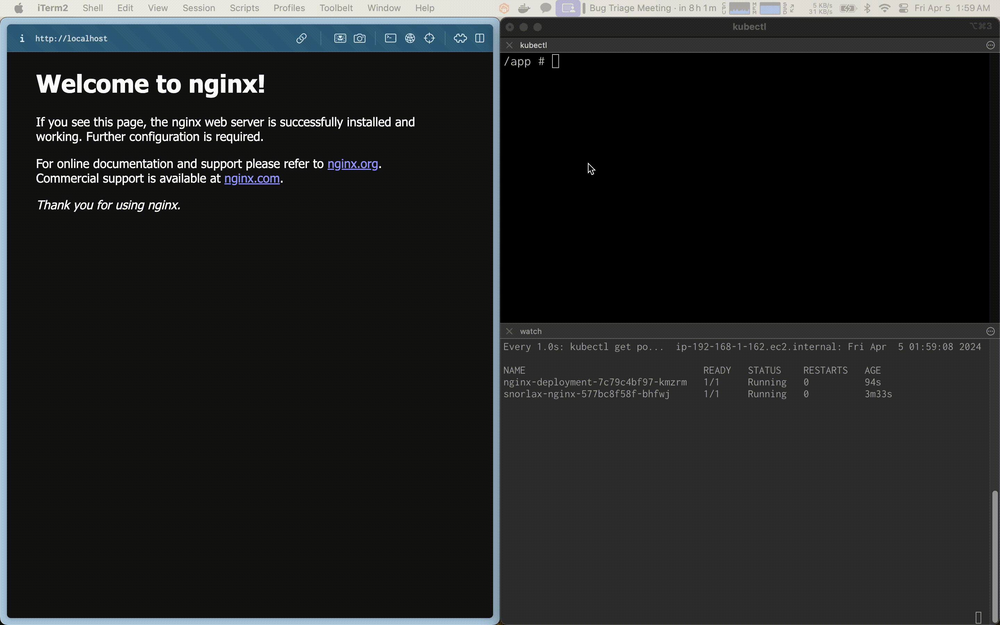

<div align="center">
  
</div>

# Snorlax

Snorlax is a Kubernetes service which wakes and sleeps another Kubernetes deployment on a schedule.

And if a request is received when the deployment is sleeping, a cute sleeping Snorlax page is
served and the Kubernetes deployment is woken up. (Once the service is ready, the page will auto-refresh.)


## See it in action




## How to deploy to your cluster

Snorlax is packaged as a Helm chart. So create a Helm values file like so:

```yaml
# values.yaml

deployment:
  env:
    # Required
    - name: REPLICA_COUNT
      value: "1"
    - name: NAMESPACE
      value: "important-namespace"
    - name: DEPLOYMENT_NAME
      value: "some-backend-deployment"
    - name: WAKE_TIME
      value: "8:00"
    - name: SLEEP_TIME
      value: "18:00"

    # Optional
    # - name: INGRESS_NAME
    #   value: "some-backend-ingress"
```

Then deploy it like so:

```bash
helm install snorlax ./snorlax \
  --values values.yaml \
  --namespace important-namespace \
  --create-namespace
```


## How to develop

If you have Go installed, you can build and run the program in full using:

```bash
export REPLICA_COUNT=1
export NAMESPACE=important-namespace
export DEPLOYMENT_NAME=some-backend-deployment
export WAKE_TIME=8:00
export SLEEP_TIME=18:00
export INGRESS_NAME=some-backend-ingress

make watch-serve
```

## Future work

- Turn this into a Kubernetes operator with a SleepSchedule CRD
- Scale entire namespaces
- Sleep when no requests are received for a certain period of time
- Add support for custom wake-up and sleep actions
- Add support for cron-style schedules (e.g., `0 8 * * *`)
- Add button to manually wake up the deployment (instead of auto-waking on request)